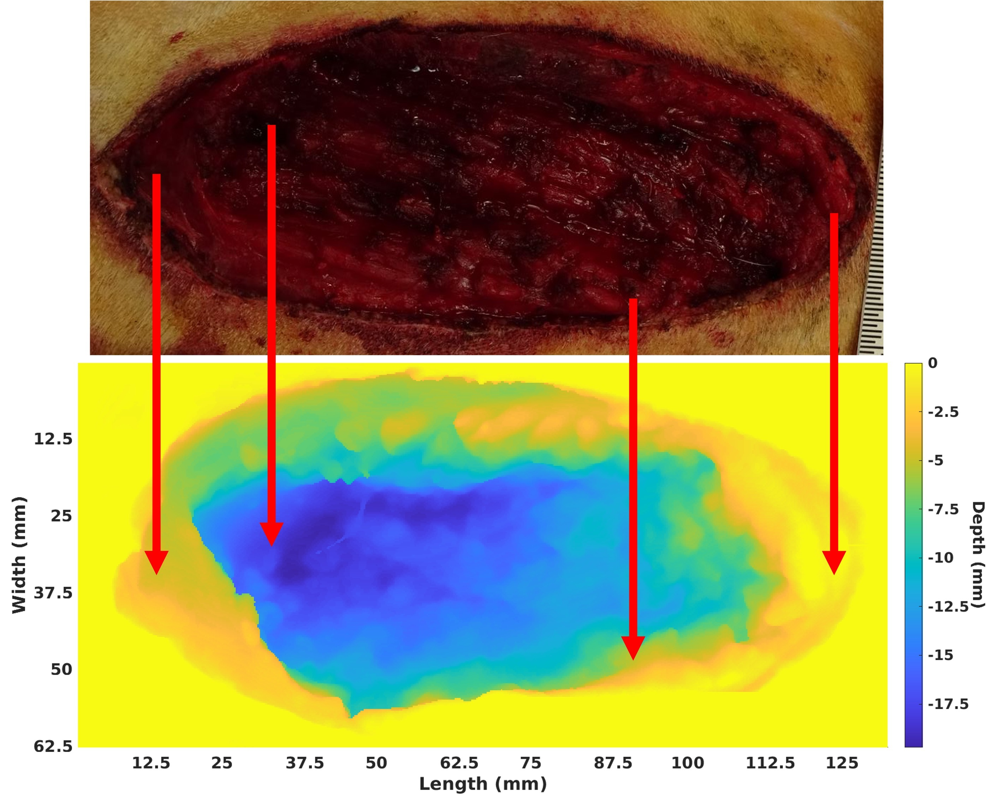
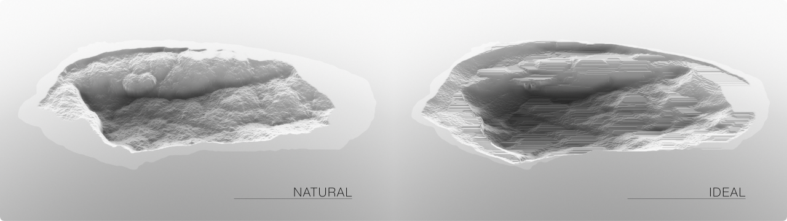

<h5>Volumetric Muscle Loss injury is a debilitating injury marked by significant loss of functionality in affected tissues.</h5>

Crum, R.J., Johnson, S.A., Jiang, P., Jui, J.H., Zamora, R., Cortes, D., Kulkarni, M., Prabahar, A., 
Bolin, J., Gann, E. and Elster, E., 2022. Transcriptomic, Proteomic, and Morphologic 
Characterization of Healing in Volumetric Muscle Loss. Tissue Engineering Part A, 28(23-24), 
pp.941-957.

<a href="https://pubmed.ncbi.nlm.nih.gov/36039923/">Read publication here</a>
