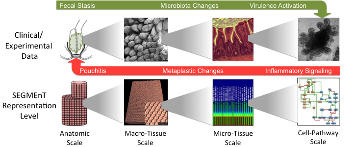

A digital twin, as defined by the individual who introduced the concept, comprises of [1]:

<ol>
  <li>A data structure for the real-world system</li>
  <li>Some process that links data together to form dynamics</li>
  <li>Some link to the real world that feeds back data into the data-propagation/generation process</li>
</ol>

The primary difference between industrial digital twins and potential medical digital twins is that in biomedicine the underlying specification is not known. Industrial digital twins are applied to objects and systems, for which, because they are engineered, there is a known formal specification. Furthermore, because the engineering task invariably involves applying constraints to a design task, the parameters of that specification and how alterations in those parameters precisely affect the dynamics of that specification are explicitly known. This is not the case in biology, where the “specification” needs to be reverse engineered through the process of basic biological research, with all the attendant uncertainties and insufficiencies in the resulting “product.”

In our lab, we use state-of-the-art machine learning techniques to discover the generative mechanisms behind biomedical phenomena from data alone.  We then computationally model the discovered/calibrated mechanisms to create a digital twin of the system in question.

    1. Grieves, M. W. (2019). “Virtually Intelligent Product Systems: Digital and Physical Twins,” in Complex Systems Engineering: Theory and Practice (Reston, VA: American Institute of Aeronautics and Astronautics), 175–200.
